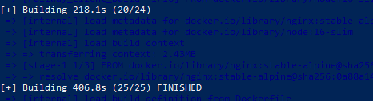
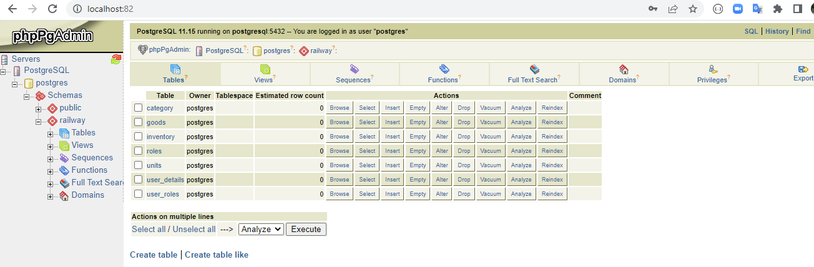
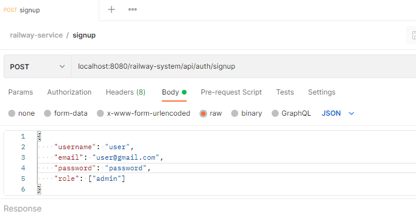
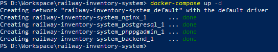
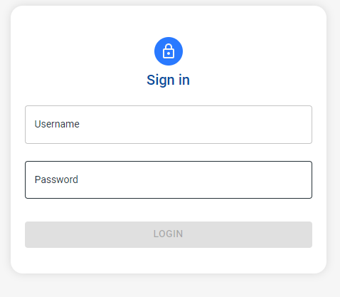
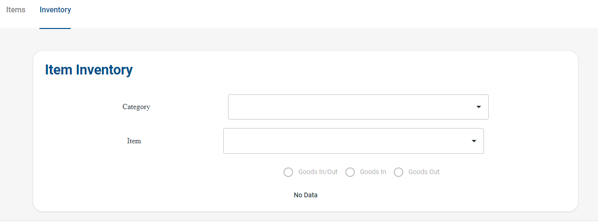
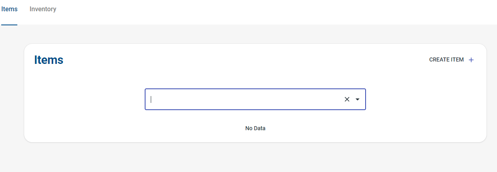

``Railway Inventory System``
---

prerequisite for run this project on local machine.
    
    1. Docker, Docker-compose
    2. Java 8
    3. Maven
    4. make (To execute Makefile)

Steps :-
 
  1. Open a powershell or cmd on your machine and redirect to the project root folder(railway-inventory-system folder). Then execute Makefile using bellow command. Makefile automatically build this project and that will be create Docker images also.
    
        ``make -f Makefile``

        

  2. Can verify if Docker images create or not using bellow command.

        ``docker images``

  3. We goning to run this project using docker-compose file. To run this project run bellow command.
       
        ``docker-compose up -d``
    
  4. Open bellow link using browser. That will open phpPgAdmin page and you can log to the database using 
  
        username: postgres
        
        password: bitnami

       ``http://localhost:82/``

 5. If there havent DB called 'postgres', you need to create a database called 'postgres' and schema called 'railway'. Then click SQL link and choose file in sql folder, then click execute. It will import reference data. Then restart docker containers using bellow commands.
     
       ``docker-compose down``

       ``docker-compose up -d``

       
       
       

       

 6. Then import the postman collection using postman and create a user using signup url and json. (Sign-up UI not implemented.)

 7. Then hit the http://localhost/sign-in URl and log the system using previous user and password.

     

     

     

     

     

